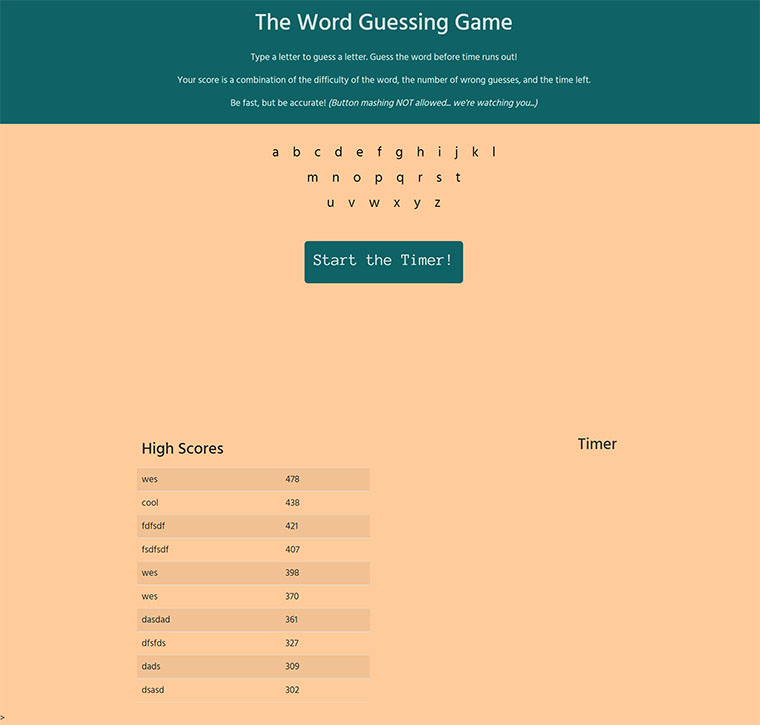
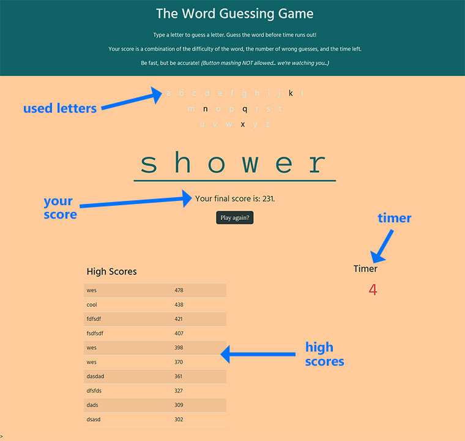

# The Word Guess Challenge

## A mini project for the UT Austin Full Stack Development Bootcamp

___

This project was assigned as a mini-project to be completed in a class session during the UT-Austin Full Stack Bootcamp. While we never actually got around to completing this in class, the concept kept me intrigued enough to want to complete it to help reiterate some additional aspects we've covered in class.

One of my major goals was to try and create this in a Bootstrap framework since I still feel much more comfortable coding straight CSS. While I think I accomplished that overall, I was trying to use Bootstrap 5.0, which is different from what we've gone over in class. While the differences seem fairly superficial, I still found some things that required me to hand code some custom CSS. My hope is that I'll learn more about the framework to not have to do as much custom work.

For now let's go over how to use the app.

[You can see it live here](https://markgatx.github.io/The-Word-Guess-Game/)

___

## How to use

When you open up the page for the first time, you'll see the instructions as well as a start button on the page. Below that you'll see the high scores as well as an area for the timer.

When you press the start button, you'll be given a row of blanks and a thirty second timer will start. Above the blanks you'll see all the letters of the alphabet. To guess a letter, simply press a key. If you're correct, the letters will fill in the appropriate spaces in the blanks. Any time you choose a letter, you'll see that letter change color in the list above the blanks to help you keep track of your selections. (NOTE:There is a rate-limiter on the keys so you won't be able to press as many keys as possible in hopes of getting correct answers. It's about 1 keypress for every half second.)

Once you've correctly guessed all the letters or the timer reaches zero, you'll get your score. The score is based on several factors including the number of letters guessed, number of unique letters in the word, length of the word, and time left. If the timer reaches zero, your score is zero.

If your score is good enough, you can save your name and score in a high scores page for local players.

___

## Changes Made and Lessons Learned

- The idea of the layout was devised by me as a simple way to reinforce concepts using Bootstrap. While I still feel faster and more in control when coding custom CSS, the Bootstrap framework is starting to become more familiar. I also can't deny the speed of coding by avoiding typing HTML and CSS for every element on the page.

- There was never a concept of a score in the mini-project as assigned. But as an avid board gamer, I needed to know a winner. While my schema for scoring is by no means an accurate reflection of the difficulty in certain words, it was something that made sense to me. 
    - One major point was the ratio of unique letters in a word to the number of letters guessed. If you guess the exact number of letters needed, you'd essentially get a score of 1. I then multiply that by a constant, which is an estimate based on subjective ratings in my brain.
    - As an approximation of difficulty, I looked at the ratio of unique letters in a word to the total length of the word. Hypothetically speaking, a five letter word with only 3 unique letters would be easier than a 5 letter word with 5 unique letters. Once again, the close the value is to 1, the more difficult the word could be. Then I multiply that by a constant as well. Because people like bigger numbers.
    - For a time bonus, I simply multiplied the time remaining by another constant.
    - I want to reiterate that these values aren't based on any scientific rationale outside of my own mind while coding this late on a Saturday night. I'd love to hear any thoughts on ways to improve the scoring mechanism.

 - Once in a life-drawing class I was told that I was afraid of color. From that day forward I made a concerted effort to push myself and use color as much as possible. I realized after getting this to minimum viable product that I still suffer from a lack of color. I will try to re-skin this in the future in bolder schemes.

 

___

## Possible Future Changes

- Bolder color schemes
- Ping dictionary API to get definitions of winning words, just for extra flair and and chance to push my Bootstrap skills more
- More words in the list of words
- Find a way to hide the words so solutions wouldn't be so obvious to anyone inspecting the code

___

## Credits

The brief append animation when the blanks first appear on screen was inspired by the article at [usefulangle.com](https://usefulangle.com/post/377/css-animation-on-dom-insert)

Thanks to all of the UT-Austin Bootcamp teachers, TAs, and students for helping to push me to be better at what I'm doing.

___

## License

MIT License

Copyright (c) 2022 Mark Gardner

Permission is hereby granted, free of charge, to any person obtaining a copy
of this software and associated documentation files (the "Software"), to deal
in the Software without restriction, including without limitation the rights
to use, copy, modify, merge, publish, distribute, sublicense, and/or sell
copies of the Software, and to permit persons to whom the Software is
furnished to do so, subject to the following conditions:

The above copyright notice and this permission notice shall be included in all
copies or substantial portions of the Software.

THE SOFTWARE IS PROVIDED "AS IS", WITHOUT WARRANTY OF ANY KIND, EXPRESS OR
IMPLIED, INCLUDING BUT NOT LIMITED TO THE WARRANTIES OF MERCHANTABILITY,
FITNESS FOR A PARTICULAR PURPOSE AND NONINFRINGEMENT. IN NO EVENT SHALL THE
AUTHORS OR COPYRIGHT HOLDERS BE LIABLE FOR ANY CLAIM, DAMAGES OR OTHER
LIABILITY, WHETHER IN AN ACTION OF CONTRACT, TORT OR OTHERWISE, ARISING FROM,
OUT OF OR IN CONNECTION WITH THE SOFTWARE OR THE USE OR OTHER DEALINGS IN THE
SOFTWARE.
